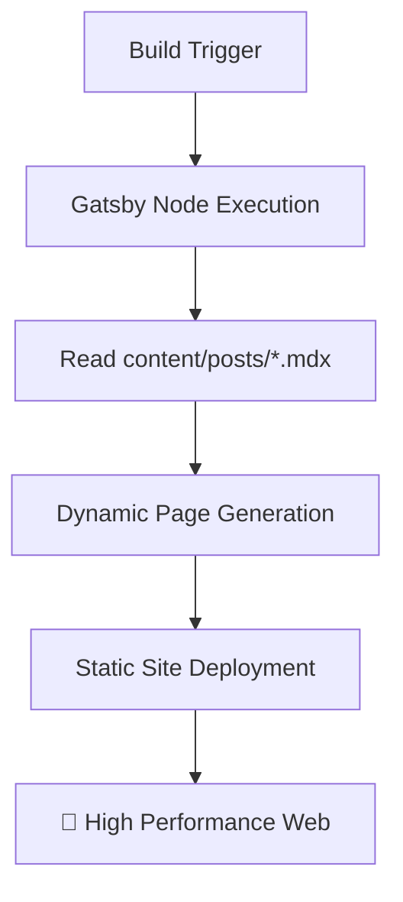

```text
 _________________________________________
/ I don't have milk for you, big ape!     \
|   Call your mom. 👾                     |
\ ----------------------------------------/
         \   ^__^
          \  (oo)\_______
             (__)\       )\/\
                 ||----w |
                 ||     ||
```

## 📋 Table of Contents

- ✨ [What is this site?](#-what-is-this-site)
- 🛠️ [Technologies Involved](#-technologies-involved)
- ✍️ [Content](#-content)
- ⚙️ [How the Site Works](#-how-the-site-works)
- 🧰 [Available Scripts](#-available-scripts)
- 👀 [PR Previews](#-pr-previews)
- 🧠 [Development Philosophy](#-development-philosophy)

---

## ✨ What is this site?

This is a personal blog and portfolio site for **Thiago Colen**. It serves as a central hub for sharing thoughts, technical articles, and professional history. The site is designed to be lightweight, performant, and automatically synchronized with the developer community. 🏗️

## 🛠️ Technologies Involved

This project leverages a modern web development stack:

| Technology       | Purpose                     | Link                                 |
| :--------------- | :-------------------------- | :----------------------------------- |
| **Gatsby**       | Static Site Generator (SSG) | [Website](https://www.gatsbyjs.com/) |
| **React**        | Core UI Library             | [Website](https://reactjs.org/)      |
| **Tailwind CSS** | Utility-first Styling       | [Website](https://tailwindcss.com/)  |
| **Axios**        | API Fetching                | [Website](https://axios-http.com/)   |
| **PostCSS**      | CSS Transformation          | [Website](https://postcss.org/)      |

## ✍️ Content

Posts are **MDX files** committed straight into the repo, one per post, under `content/posts/<slug>.mdx`. The filename (minus extension) is the slug. Frontmatter carries the metadata; the body is MDX (Markdown, with the option to drop in React components — e.g. rich embeds via `mdx-embed`):

```yaml
---
title: "Post Title"
description: "Short summary shown in listings"
published_at: "2026-07-15T12:00:00Z"   # empty/null for drafts
cover_image: "https://example.com/cover.png"
status: "unpublished"   # or "published"
tags: ["nodejs", "javascript"]
---

Body content in MDX...
```

There's no database and nothing to sync — the committed files *are* the source of truth, for drafts and published posts alike. See [Available Scripts](#-available-scripts) for the two helper scripts that create and publish posts.

## ⚙️ How the Site Works

The site follows the **JAMstack** architecture:



1. **Build Phase:** During the Gatsby build process (`gatsby-node.js`), a GraphQL query reads every MDX post sourced from `content/posts/` via `gatsby-source-filesystem` + `gatsby-plugin-mdx`. 📄
2. **Filtering:** `gatsby develop` includes unpublished drafts too, so they can be previewed locally. `gatsby build` (production and CI/PR previews) keeps only posts with `status: published`.
3. **Page Generation:** Gatsby creates individual post pages at `/blog/post/[slug]/` and updates the article lists on the home and blog pages.
4. **Deployment:** Once the build is complete, a static version of the site is deployed, ensuring high performance and security. 🛡️

## 🧰 Available Scripts

Every script below is run with `npm run <name>` (e.g. `npm run develop`).

### Site lifecycle

| Script | Command | What it does |
| :--- | :--- | :--- |
| `develop` | `gatsby develop` | Starts the local dev server with hot reload, usually at `http://localhost:8000`. This is what you run day-to-day while writing code. |
| `start` | `gatsby develop` | Alias for `develop`. Exists because `npm start` is the conventional entry point many tools (and habits) expect. |
| `build` | `gatsby build` | Produces the optimized, static production build in `public/` — runs `gatsby-node.js` (page creation from `content/posts/*.mdx`) and `gatsby-config.js` (plugin/source setup) as part of the build. |
| `serve` | `gatsby serve` | Serves the already-built `public/` folder locally, so you can sanity-check a production build before deploying it. Run `build` first. |
| `clean` | `gatsby clean` | Deletes Gatsby's cache and `public/` output (`.cache/`, `public/`). Use this when the dev server is misbehaving after config/schema changes — a stale cache is a common culprit. |
| `deploy` | `gatsby build && gh-pages -d public` | Builds the site, then publishes the `public/` folder to the `gh-pages` branch via the `gh-pages` package. This is the manual production deploy path. |

### Post scripts

Posts are plain files under `content/posts/` — see [Content](#-content) for the frontmatter shape. These two scripts are conveniences, not requirements; you can also just create/edit the `.mdx` files by hand.

| Script | Command | What it does |
| :--- | :--- | :--- |
| `new-post` | `node develop-tools/new-post.js "Title" tag1,tag2` | Scaffolds `content/posts/<slug>.mdx` with `status: unpublished` and empty frontmatter fields ready to fill in. Slug is derived from the title. Refuses to overwrite an existing file. |
| `publish-post` | `node develop-tools/publish-post.js <slug>` | Flips a post's `status` from `unpublished` to `published`. No-op (not an error) if already published. Sets `published_at` to the current time only if it isn't already set, so republishing after an edit never clobbers the original publish date. |

After publishing, commit `content/posts/` and run `npm run deploy` (or push — see [PR Previews](#-pr-previews)) to ship it.

## 👀 PR Previews

Every pull request is built and published to a preview URL, so changes can be reviewed from any device before being merged:

```
https://thiagocolen.github.io/pr-preview/pr-<number>/
```

The preview is created when the PR opens, refreshed on every push, and deleted when the PR is closed or merged. Since posts are committed MDX files, previews always build from exactly what's in the PR — there's no separate sync step to remember.

## 🧠 Development Philosophy

Code is viewed as both a functional tool and a medium for technical expression. This repository serves as a digital record of professional growth, where technical challenges and bugs are approached as iterative learning milestones. The logical component architecture emphasizes order and clarity, while writing in plain MDX files keeps the content itself close to the code.

> This project represents a convergence of systematic engineering and creative digital craftsmanship—though whether it constitutes a genuine human endeavor or merely a curated batch of high-fidelity AI slop is left entirely to the reader's suspicious intuition. 🤖❔

---

_Made with 🤢 (and potentially some slop) by ~~Thiago Colen~~._ 👾
