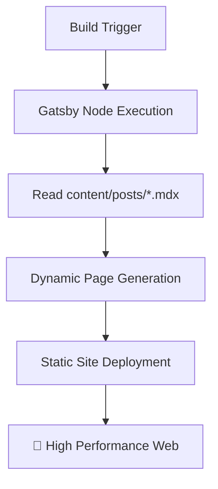

```text
 _________________________________________
/ I don't have milk for you, big ape!     \
|   Call your mom. 👾                     |
\ ----------------------------------------/
         \   ^__^
          \  (oo)\_______
             (__)\       )\/\
                 ||----w |
                 ||     ||
```

## 📋 Table of Contents

- ✨ [What is this site?](#-what-is-this-site)
- 🛠️ [Technologies Involved](#-technologies-involved)
- ✍️ [Content](#-content)
- ⚙️ [How the Site Works](#-how-the-site-works)
- 🧰 [Available Scripts](#-available-scripts)
- 🚀 [Publishing a Post](#-publishing-a-post)
- 🤖 [Publishing from an AI agent](#-publishing-from-an-ai-agent)
- 👀 [PR Previews](#-pr-previews)
- 🧠 [Development Philosophy](#-development-philosophy)

---

## ✨ What is this site?

This is a personal blog and portfolio site for **Thiago Colen**. It serves as a central hub for sharing thoughts, technical articles, and professional history. The site is designed to be lightweight, performant, and automatically synchronized with the developer community. 🏗️

## 🛠️ Technologies Involved

This project leverages a modern web development stack:

| Technology       | Purpose                     | Link                                 |
| :--------------- | :-------------------------- | :----------------------------------- |
| **Gatsby**       | Static Site Generator (SSG) | [Website](https://www.gatsbyjs.com/) |
| **React**        | Core UI Library             | [Website](https://reactjs.org/)      |
| **Tailwind CSS** | Utility-first Styling       | [Website](https://tailwindcss.com/)  |
| **Axios**        | API Fetching                | [Website](https://axios-http.com/)   |
| **PostCSS**      | CSS Transformation          | [Website](https://postcss.org/)      |

## ✍️ Content

Posts are **MDX files** committed straight into the repo, one per post, under `content/posts/<slug>.mdx`. The filename (minus extension) is the slug. Frontmatter carries the metadata; the body is MDX (Markdown, with the option to drop in React components — e.g. rich embeds via `mdx-embed`):

```yaml
---
title: "Post Title"
headline: "Deck shown under the title on the post page"
description: "Short summary shown in listings"
published_at: "2026-07-15T12:00:00Z"   # empty/null for drafts
cover_image: "https://example.com/cover.png"
status: "unpublished"   # or "published"
tags: ["nodejs", "javascript"]
---

Body content in MDX...
```

`headline` and `description` are easy to conflate but land in different places: the **headline** is the deck rendered under the `<h1>` on the post page itself, while the **description** is the blurb on article cards and in listings, and is *not* shown on the post page.

There's no database and nothing to sync — the committed files *are* the source of truth, for drafts and published posts alike. See [Publishing a Post](#-publishing-a-post) for the full walkthrough.

## ⚙️ How the Site Works

The site follows the **JAMstack** architecture:



1. **Build Phase:** During the Gatsby build process (`gatsby-node.js`), a GraphQL query reads every MDX post sourced from `content/posts/` via `gatsby-source-filesystem` + `gatsby-plugin-mdx`. 📄
2. **Filtering:** `gatsby develop` includes unpublished drafts too, so they can be previewed locally. `gatsby build` (production and CI/PR previews) keeps only posts with `status: published`.
3. **Page Generation:** Gatsby creates individual post pages at `/blog/post/[slug]/` and updates the article lists on the home and blog pages.
4. **Deployment:** Once the build is complete, a static version of the site is deployed, ensuring high performance and security. 🛡️

## 🧰 Available Scripts

Every script below is run with `npm run <name>` (e.g. `npm run develop`).

### Site lifecycle

| Script | Command | What it does |
| :--- | :--- | :--- |
| `develop` | `gatsby develop` | Starts the local dev server with hot reload, usually at `http://localhost:8000`. This is what you run day-to-day while writing code. |
| `start` | `gatsby develop` | Alias for `develop`. Exists because `npm start` is the conventional entry point many tools (and habits) expect. |
| `build` | `gatsby build` | Produces the optimized, static production build in `public/` — runs `gatsby-node.js` (page creation from `content/posts/*.mdx`) and `gatsby-config.js` (plugin/source setup) as part of the build. |
| `serve` | `gatsby serve` | Serves the already-built `public/` folder locally, so you can sanity-check a production build before deploying it. Run `build` first. |
| `clean` | `gatsby clean` | Deletes Gatsby's cache and `public/` output (`.cache/`, `public/`). Use this when the dev server is misbehaving after config/schema changes — a stale cache is a common culprit. |
| `deploy` | `gatsby clean && gatsby build && node develop-tools/deploy.js` | The manual production deploy path, in three parts: wipe the cache and `public/` so no stale hashed bundle from an earlier build rides along, build fresh, then publish `public/` to the `gh-pages` branch. The publish step goes through `develop-tools/deploy.js` rather than the `gh-pages` CLI so it removes everything on the branch *except* `pr-preview/` — see [PR Previews](#-pr-previews). |

### Post scripts

Posts are plain files under `content/posts/` — see [Content](#-content) for the frontmatter shape. These scripts are conveniences, not requirements; you can also just create/edit/delete the `.mdx` files by hand.

| Script | Command | What it does |
| :--- | :--- | :--- |
| `new-post` | `npm run new-post -- "Title" tag1,tag2` | Scaffolds `content/posts/<slug>.mdx` with `status: unpublished` and empty frontmatter fields ready to fill in. Slug is derived from the title. Refuses to overwrite an existing file. |
| `publish-post` | `npm run publish-post -- <slug>` | Flips a post's `status` from `unpublished` to `published`. No-op (not an error) if already published. Sets `published_at` to the current time only if it isn't already set, so republishing after an edit never clobbers the original publish date. |
| `unpublish-post` | `npm run unpublish-post -- <slug>` | The inverse: flips `status` back to `unpublished`, so the post is dropped from production builds while still showing up in `develop`. No-op if it isn't published. Leaves `published_at` alone, so republishing later keeps the original date. |
| `delete-post` | `npm run delete-post -- <slug> [--dry-run] [--keep-assets]` | Removes `content/posts/<slug>.mdx` **and** the `static/images/` files only that post references (its `cover_image` plus any `/images/...` in the body). An image another post still uses is kept and reported. `--dry-run` prints the file list without touching anything; `--keep-assets` deletes just the `.mdx`. |

> The `--` is not optional. Without it, npm swallows the arguments and the script sees nothing.

`new-post` and `publish-post` are the middle of a longer flow — see [Publishing a Post](#-publishing-a-post) for the whole thing, start to finish.

For taking something down, prefer `unpublish-post`: deleting a post that has been live breaks its permalink for anyone who linked to it, while unpublishing just removes it from production builds. Either way the change only reaches the site once you commit and deploy.

## 🚀 Publishing a Post

The whole journey, from empty file to live site:

```
new-post → write → develop (preview) → publish-post → commit/push → PR (preview URL) → merge → deploy
```

Nine steps, and only the last one is outward-facing.

### 1. Scaffold the draft

```bash
npm run new-post -- "My Post Title" nodejs,javascript
```

Creates `content/posts/my-post-title.mdx` with `status: unpublished`. The slug comes from the title (lowercased, non-alphanumerics collapsed to hyphens) and becomes the URL at `/blog/post/<slug>/`. The script refuses to overwrite an existing file, so a title collision fails loudly rather than eating your draft.

Tags are optional — pass them comma-separated, with no spaces around the commas.

### 2. Write it

Open the generated `.mdx` and fill in the frontmatter:

```yaml
---
title: My Post Title            # the <h1>
headline: The one-line deck     # subtitle under the <h1>, on the post page
description: Listing blurb      # article cards + SEO; NOT shown on the post page
published_at: null              # leave null — publish-post stamps it
cover_image: /images/my-post.jpg
status: unpublished             # leave it — publish-post flips it
tags:
  - nodejs
  - javascript
---
```

Then write the body below the frontmatter. It's MDX, so plain Markdown and HTML both work, plus two extras that need **no import**:

- `<Callout type="note|tip|warn" title="Optional heading">…</Callout>` — an unrecognised `type` degrades to `note` instead of crashing the page.
- The [mdx-embed](https://www.mdx-embed.com/) shortcodes: `<YouTube>`, `<CodePen>`, `<Tweet>`, and friends.

Both come from the `MDXProvider` in `src/wrapRootElement.js`. A component that isn't in that map doesn't degrade gracefully — it fails to render, so stick to what's registered.

### 3. Add images (optional)

Two options:

- **Already hosted somewhere?** Put the URL straight into `cover_image` or an `` in the body. Nothing to do.
- **Local file?** Drop it in `static/images/` and reference it root-relative as `/images/my-post.jpg`. Gatsby copies `static/` verbatim to the site root.

Keep local paths root-relative (`/images/…`, not `images/…`): `src/utils/assetUrl.js` rewrites them for PR previews, which build under a path prefix. Skip the leading slash and the image works locally and in production but 404s in the preview — the one place you'll actually be reviewing it.

Note there's no image optimisation pipeline. `gatsby-plugin-sharp` is in `package.json` but not enabled in `gatsby-config.js`, so local images ship at whatever size you dropped in. Resize before committing.

### 4. Preview locally

```bash
npm run develop
```

Then open `http://localhost:8000`. Your draft appears in the listings even though it's unpublished — `gatsby develop` deliberately includes drafts so you can see them, while `gatsby build` filters them out (see [How the Site Works](#-how-the-site-works)).

Iterate here as long as you like. Hot reload picks up frontmatter and body edits.

### 5. Publish — flip the flag

```bash
npm run publish-post -- my-post-title
```

Sets `status: published` and stamps `published_at` with the current time — but **only if it isn't already set**, so re-publishing after a later edit never clobbers the original date. Running it twice is a no-op, not an error.

> **This edits a file. Nothing is live yet.** "Published" here means the post is no longer filtered out of production builds. It says nothing about whether a build has happened.

### 6. Commit and push

```bash
git add content/posts static/images
git commit -m 'content: add "My Post Title"'
git push origin new-articles
```

Pushing doesn't build anything. The only workflow in the repo, `pr-preview.yml`, triggers on `pull_request` — not on `push`.

### 7. Open a PR into `master` and check the preview

`new-articles` is where posts are staged; `master` is where they're integrated and what gets deployed. So the PR goes `new-articles → master`.

Opening the PR is what triggers the preview build, published at `https://thiagocolen.github.io/pr-preview/pr-<number>/`. It refreshes on every push to the branch and is deleted when the PR closes. See [PR Previews](#-pr-previews) for details.

This is the real review step: the preview is a production build, so it's the first place you see the post as readers will — drafts filtered out, path prefixes applied, images resolved.

### 8. Merge the PR

Merging still doesn't deploy anything — no workflow builds `master` on push.

### 9. Deploy

```bash
git checkout master
git pull
npm run deploy
```

`npm run deploy` is `gatsby clean && gatsby build && node develop-tools/deploy.js`: it clears the cache, builds the site, and pushes `public/` to the `gh-pages` branch, which is what GitHub Pages serves. **This is the only step that touches the live site.**

If dependencies aren't installed yet, use `npm install --legacy-peer-deps` — `gatsby-plugin-mdx-embed@0.0.20-alpha` declares a peer on react@16 while the project is on react@17, which npm's strict resolver rejects. CI does the same thing (`npm ci --legacy-peer-deps` in `pr-preview.yml`).

---

> ⚠️ **Stop the dev server before deploying.** `gatsby build` and `gatsby develop` share the same `.cache/` and `public/` directories. Running a build while the dev server is up corrupts the cache and can produce a broken build with no obvious error. If it happens, `npm run clean` and start over.

> 🚦 **Two independent gates.** `status: published` (a flag in a file) and `npm run deploy` (an actual deploy) are unrelated. Steps 1–8 are all reversible; only step 9 is visible to anyone else.

Prefer to have an agent do the writing? Same flow, different driver — see below.

## 🤖 Publishing from an AI agent

`mcp-server/` is an [MCP](https://modelcontextprotocol.io) server that exposes the post lifecycle as typed tools, so an AI agent (Claude Code, Claude Desktop, Cursor — anything that speaks MCP) can draft, edit and publish articles without guessing at shell commands.

It's registered in `.mcp.json`, so Claude Code picks it up automatically in this repo. Install its dependencies once:

```bash
cd mcp-server && npm install
```

| Tool | What it does |
| :--- | :--- |
| `list_posts` | Every article with slug, title, status, date and tags |
| `read_post` | One article's frontmatter and MDX body |
| `create_draft` | New `.mdx` with `status: unpublished`; refuses to overwrite |
| `update_post` | Partial update of metadata and/or body |
| `publish_post` | Flip to `published` and stamp `published_at` |
| `stage_changes` | Commit and push the posts to the `new-articles` branch |

All tools share `develop-tools/posts.js` with the npm scripts above, so the CLI and the agent can't drift apart.

### Where the agent can and can't reach

The agent works in your **main working tree**, switching it to a branch called `new-articles` on every call. Two things follow from that:

- **Everything stays on `new-articles`.** The commit pathspec is an explicit allowlist (`content/posts`, `static/images`), so an unrelated dirty file can't ride along — but the switch itself moves your working tree. If uncommitted changes would block it, the call fails with an explanation instead of forcing it, so commit or stash first.
- **Nothing the agent does can reach the live site.** No workflow builds `new-articles` — `pr-preview.yml` triggers on `pull_request`, not `push`. The agent stages; *you* open the PR, which is what triggers the preview build, and `npm run deploy` stays manual.

```
agent → new-articles → you open a PR → preview build → merge → npm run deploy
```

`new-articles` is branched from whatever the working tree was on before the first switch, falling back to `master` (override with `MCP_BASE_BRANCH`). Starting from `master` is the normal case — it carries the content pipeline and every published post, and it's the branch the PR targets.

Two tradeoffs worth knowing: a publishing session **leaves your working tree checked out on `new-articles`** (files stay uncommitted there until `stage_changes`), and because agent drafts live on `new-articles`, `npm run develop` from that branch is where you preview them — or open the PR and use the preview URL.

## 👀 PR Previews

Every pull request is built and published to a preview URL, so changes can be reviewed from any device before being merged:

```
https://thiagocolen.github.io/pr-preview/pr-<number>/
```

The preview is created when the PR opens, refreshed on every push, and deleted when the PR is closed or merged. Since posts are committed MDX files, previews always build from exactly what's in the PR — there's no separate sync step to remember.

Previews share the `gh-pages` branch with the production site, living under `pr-preview/` while the site itself sits at the root. That's why `npm run deploy` publishes through `develop-tools/deploy.js` instead of the `gh-pages` CLI: the package's default is to `git rm` the entire branch before copying the new build, which would take every open PR's preview with it. The script removes everything *except* `pr-preview/`, so deploying while a PR is open is safe.

## 🧠 Development Philosophy

Code is viewed as both a functional tool and a medium for technical expression. This repository serves as a digital record of professional growth, where technical challenges and bugs are approached as iterative learning milestones. The logical component architecture emphasizes order and clarity, while writing in plain MDX files keeps the content itself close to the code.

> This project represents a convergence of systematic engineering and creative digital craftsmanship—though whether it constitutes a genuine human endeavor or merely a curated batch of high-fidelity AI slop is left entirely to the reader's suspicious intuition. 🤖❔

---

_Made with 🤢 (and potentially some slop) by ~~Thiago Colen~~._ 👾
