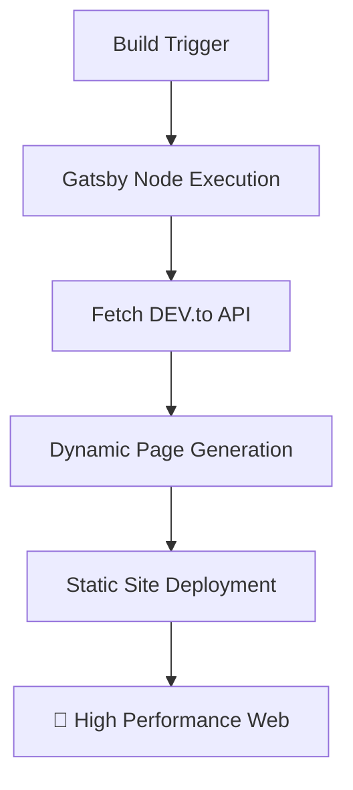

```text
 _________________________________________      ~ random fake plastic tree ~
/ I don't have milk for you, big ape!     \        &&&
|   Call your mom. 👾                     |       &&&
\ ----------------------------------------/        |
         \   ^__^                                |
          \  (oo)\_______                       |
             (__)\       )\/\                  |
                 ||----w |                         |
                 ||     ||                         |
```

## 📋 Table of Contents

- ✨ [What is this site?](#-what-is-this-site)
- 🛠️ [Technologies Involved](#-technologies-involved)
- 📡 [DEV.to Integration](#-devto-integration)
- ⚙️ [How the Site Works](#-how-the-site-works)
- 🧠 [Development Philosophy](#-development-philosophy)
- 🎸 [What is Fake Plastic Trees?](#-what-is-fake-plastic-trees)

---

## ✨ What is this site?

This is a personal blog and portfolio site for **Thiago Colen**. It serves as a central hub for sharing thoughts, technical articles, and professional history. The site is designed to be lightweight, performant, and automatically synchronized with the developer community. 🏗️

## 🛠️ Technologies Involved

This project leverages a modern web development stack:

| Technology       | Purpose                     | Link                                 |
| :--------------- | :-------------------------- | :----------------------------------- |
| **Gatsby**       | Static Site Generator (SSG) | [Website](https://www.gatsbyjs.com/) |
| **React**        | Core UI Library             | [Website](https://reactjs.org/)      |
| **Tailwind CSS** | Utility-first Styling       | [Website](https://tailwindcss.com/)  |
| **Axios**        | API Fetching                | [Website](https://axios-http.com/)   |
| **PostCSS**      | CSS Transformation          | [Website](https://postcss.org/)      |

## 📡 DEV.to Integration (`dev.to`)

The heart of the content management system is **[DEV.to](https://dev.to/)**. 🖋️
Instead of maintaining a local database or a custom CMS, the site fetches articles directly from Thiago's DEV.to account (`thiagocolen`) using the official DEV.to API. This allows for a "write once, publish everywhere" workflow. 🌐

## ⚙️ How the Site Works

The site follows the **JAMstack** architecture:



1. **Build Phase:** During the Gatsby build process (`gatsby-node.js`), the site makes authenticated requests to the DEV.to API using a secure `DEV_TO_API_KEY`. 🔑
2. **Data Fetching:** It retrieves all published articles and their full content. 📦
3. **Page Generation:** Gatsby dynamically creates individual post pages for each article at `/blog/post/[slug]/` and updates the article lists on the home and blog pages. 📄
4. **Deployment:** Once the build is complete, a static version of the site is deployed, ensuring high performance and security. 🛡️

## 🎸 What is Fake Plastic Trees?

**Fake Plastic Trees** is a Radiohead song from the 1995 album *The Bends*. The title works as an image of artificial nature: something shaped to look alive, comforting, and organic, but ultimately manufactured and hollow. That image fits the broader concern of the song with people trying to find sincerity inside a culture of substitutes, surfaces, consumer objects, and performed identities.

The song is often read as a portrait of emotional exhaustion in a plastic world. Its characters appear trapped by imitation, beauty standards, romance, and the pressure to look whole even when they feel depleted. Rather than explaining those ideas directly, the song layers small images of synthetic objects and fragile people until the setting feels both ordinary and quietly surreal.

Musically, it starts as a restrained acoustic ballad and gradually swells into a larger arrangement, making the emotional tension feel like it is breaking through a carefully controlled surface. That contrast is why the song is remembered as an early bridge for Radiohead between alternative rock songwriting and the more anxious, atmospheric themes the band explored later.

In short: a fake plastic tree is a symbol of artificial comfort, and the song asks what happens when that artificiality surrounds not just objects, but relationships, identity, and hope.

## 🧠 Development Philosophy

Code is viewed as both a functional tool and a medium for technical expression. This repository serves as a digital record of professional growth, where technical challenges and bugs are approached as iterative learning milestones. The logical component architecture emphasizes order and clarity, while the integration with DEV.to facilitates community-driven knowledge sharing.

> This project represents a convergence of systematic engineering and creative digital craftsmanship—though whether it constitutes a genuine human endeavor or merely a curated batch of high-fidelity AI slop is left entirely to the reader's suspicious intuition. 🤖❔

---

_Made with 🤢 (and potentially some slop) by ~~Thiago Colen~~._ 👾
