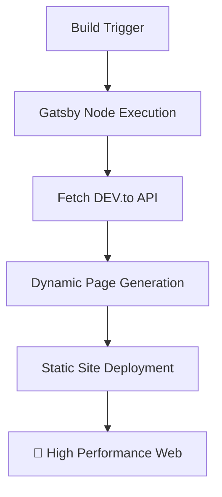

```text
 _________________________________________
/ I don't have milk for you, big ape!     \
|   Call your mom. 👾                     |
\ ----------------------------------------/
         \   ^__^
          \  (oo)\_______
             (__)\       )\/\
                 ||----w |
                 ||     ||
```

## 📋 Table of Contents

- ✨ [What is this site?](#-what-is-this-site)
- 🛠️ [Technologies Involved](#-technologies-involved)
- 📡 [DEV.to Integration](#-devto-integration)
- ⚙️ [How the Site Works](#-how-the-site-works)
- 👀 [PR Previews](#-pr-previews)
- 🧠 [Development Philosophy](#-development-philosophy)

---

## ✨ What is this site?

This is a personal blog and portfolio site for **Thiago Colen**. It serves as a central hub for sharing thoughts, technical articles, and professional history. The site is designed to be lightweight, performant, and automatically synchronized with the developer community. 🏗️

## 🛠️ Technologies Involved

This project leverages a modern web development stack:

| Technology       | Purpose                     | Link                                 |
| :--------------- | :-------------------------- | :----------------------------------- |
| **Gatsby**       | Static Site Generator (SSG) | [Website](https://www.gatsbyjs.com/) |
| **React**        | Core UI Library             | [Website](https://reactjs.org/)      |
| **Tailwind CSS** | Utility-first Styling       | [Website](https://tailwindcss.com/)  |
| **Axios**        | API Fetching                | [Website](https://axios-http.com/)   |
| **PostCSS**      | CSS Transformation          | [Website](https://postcss.org/)      |

## 📡 DEV.to Integration (`dev.to`)

The heart of the content management system is **[DEV.to](https://dev.to/)**. 🖋️
Instead of maintaining a local database or a custom CMS, the site fetches articles directly from Thiago's DEV.to account (`thiagocolen`) using the official DEV.to API. This allows for a "write once, publish everywhere" workflow. 🌐

## ⚙️ How the Site Works

The site follows the **JAMstack** architecture:



1. **Build Phase:** During the Gatsby build process (`gatsby-node.js`), the site makes authenticated requests to the DEV.to API using a secure `DEV_TO_API_KEY`. 🔑
2. **Data Fetching:** It retrieves all published articles and their full content. 📦
3. **Page Generation:** Gatsby dynamically creates individual post pages for each article at `/blog/post/[slug]/` and updates the article lists on the home and blog pages. 📄
4. **Deployment:** Once the build is complete, a static version of the site is deployed, ensuring high performance and security. 🛡️

## 👀 PR Previews

Every pull request is built and published to a preview URL, so changes can be reviewed from any device before being merged:

```
https://thiagocolen.github.io/pr-preview/pr-<number>/
```

The preview is created when the PR opens, refreshed on every push, and deleted when the PR is closed or merged.

**⚠️ Keeping previews in sync with your posts:** the local database (`src/data/posts.db`) is the source of true and is never committed, so CI cannot read it. Preview builds instead rebuild a database from `src/data/schema.sql` and seed it from `src/data/published-posts.json`.

That means **after publishing a new post, re-export and commit the JSON** — otherwise previews will show stale content:

```bash
npm run db:export   # writes src/data/published-posts.json (published posts only)
```

Only `published` posts are exported; unpublished drafts stay local and out of git.

| Command | Purpose |
| :--- | :--- |
| `npm run db:init` | Create the database from `schema.sql` (idempotent) |
| `npm run db:export` | Export published posts to `published-posts.json` |
| `npm run db:seed` | Init + seed from the JSON — what CI runs |

## 🧠 Development Philosophy

Code is viewed as both a functional tool and a medium for technical expression. This repository serves as a digital record of professional growth, where technical challenges and bugs are approached as iterative learning milestones. The logical component architecture emphasizes order and clarity, while the integration with DEV.to facilitates community-driven knowledge sharing.

> This project represents a convergence of systematic engineering and creative digital craftsmanship—though whether it constitutes a genuine human endeavor or merely a curated batch of high-fidelity AI slop is left entirely to the reader's suspicious intuition. 🤖❔

---

_Made with 🤢 (and potentially some slop) by ~~Thiago Colen~~._ 👾
