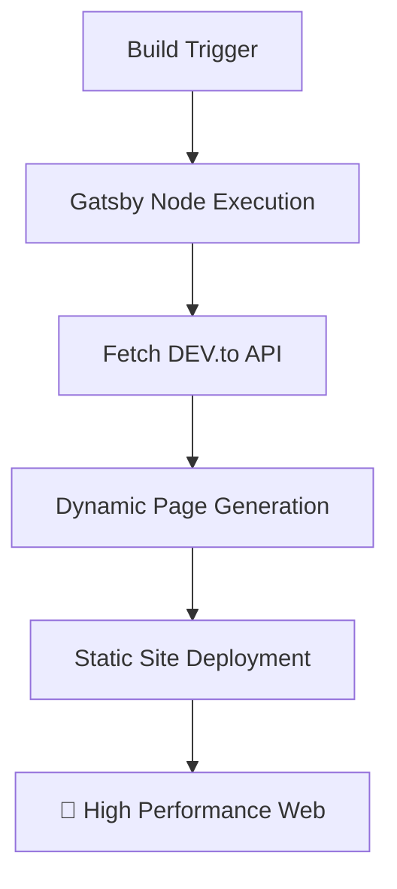

```text
 _________________________________________
/ I don't have milk for you, big ape!     \
|   Call your mom. 👾                     |
\ ----------------------------------------/
         \   ^__^
          \  (oo)\_______
             (__)\       )\/\
                 ||----w |
                 ||     ||
```

## 📋 Table of Contents

- ✨ [What is this site?](#-what-is-this-site)
- 🛠️ [Technologies Involved](#-technologies-involved)
- 📡 [DEV.to Integration](#-devto-integration)
- ⚙️ [How the Site Works](#-how-the-site-works)
- 🧰 [Available Scripts](#-available-scripts)
- 👀 [PR Previews](#-pr-previews)
- 🧠 [Development Philosophy](#-development-philosophy)

---

## ✨ What is this site?

This is a personal blog and portfolio site for **Thiago Colen**. It serves as a central hub for sharing thoughts, technical articles, and professional history. The site is designed to be lightweight, performant, and automatically synchronized with the developer community. 🏗️

## 🛠️ Technologies Involved

This project leverages a modern web development stack:

| Technology       | Purpose                     | Link                                 |
| :--------------- | :-------------------------- | :----------------------------------- |
| **Gatsby**       | Static Site Generator (SSG) | [Website](https://www.gatsbyjs.com/) |
| **React**        | Core UI Library             | [Website](https://reactjs.org/)      |
| **Tailwind CSS** | Utility-first Styling       | [Website](https://tailwindcss.com/)  |
| **Axios**        | API Fetching                | [Website](https://axios-http.com/)   |
| **PostCSS**      | CSS Transformation          | [Website](https://postcss.org/)      |

## 📡 DEV.to Integration (`dev.to`)

The heart of the content management system is **[DEV.to](https://dev.to/)**. 🖋️
Instead of maintaining a local database or a custom CMS, the site fetches articles directly from Thiago's DEV.to account (`thiagocolen`) using the official DEV.to API. This allows for a "write once, publish everywhere" workflow. 🌐

## ⚙️ How the Site Works

The site follows the **JAMstack** architecture:



1. **Build Phase:** During the Gatsby build process (`gatsby-node.js`), the site makes authenticated requests to the DEV.to API using a secure `DEV_TO_API_KEY`. 🔑
2. **Data Fetching:** It retrieves all published articles and their full content. 📦
3. **Page Generation:** Gatsby dynamically creates individual post pages for each article at `/blog/post/[slug]/` and updates the article lists on the home and blog pages. 📄
4. **Deployment:** Once the build is complete, a static version of the site is deployed, ensuring high performance and security. 🛡️

## 🧰 Available Scripts

Every script below is run with `npm run <name>` (e.g. `npm run develop`).

### Site lifecycle

| Script | Command | What it does |
| :--- | :--- | :--- |
| `develop` | `gatsby develop` | Starts the local dev server with hot reload, usually at `http://localhost:8000`. This is what you run day-to-day while writing code. |
| `start` | `gatsby develop` | Alias for `develop`. Exists because `npm start` is the conventional entry point many tools (and habits) expect. |
| `build` | `gatsby build` | Produces the optimized, static production build in `public/` — runs `gatsby-node.js` (page creation from the local SQLite DB) and `gatsby-config.js` (plugin/source setup) as part of the build. |
| `serve` | `gatsby serve` | Serves the already-built `public/` folder locally, so you can sanity-check a production build before deploying it. Run `build` first. |
| `clean` | `gatsby clean` | Deletes Gatsby's cache and `public/` output (`.cache/`, `public/`). Use this when the dev server is misbehaving after config/schema changes — a stale cache is a common culprit. |
| `deploy` | `gatsby build && gh-pages -d public` | Builds the site, then publishes the `public/` folder to the `gh-pages` branch via the `gh-pages` package. This is the manual production deploy path. |

### Database tooling (`src/data/posts.db`)

The blog's posts live in a local SQLite database, `src/data/posts.db`, which is **never committed** (see `.gitignore`) — it's the personal, editable source of truth for drafts and published posts alike. `src/data/schema.sql` is the committed, reference copy of its schema. These scripts create, populate, and export that database:

| Script | Command | What it does |
| :--- | :--- | :--- |
| `db:migrate` | `node develop-tools/migrate-devto-to-sqlite.js` | **One-time, legacy.** Pulls every article from the Dev.to API (with retry/rate-limit handling) and seeds `posts.db` with them, marking each `published`. This was the original bootstrap from Dev.to → local DB and is kept for historical/reference purposes; it refuses to overwrite posts already marked `published`. |
| `db:add-status` | `node develop-tools/add-status-column.js` | **One-time, legacy.** Adds the `status` column (`published`/`unpublished`) to an existing `posts.db` that predates it, and backfills existing rows to `published`. Idempotent — does nothing if the column already exists. |
| `db:add-posts` | `node develop-tools/add-posts-from-json.js <path-to-json>` | **The main way to add or update posts.** Reads a JSON file — a single post object or an array of them, see `develop-tools/schema/posts.schema.json` and `develop-tools/schema/post.example.json` — and upserts it into `posts.db`, matching on `slug`. New slugs are inserted; existing `unpublished` posts are updated; existing `published` posts are **skipped**, since published posts are treated as read-only. Respects `POSTS_DB_PATH` to target a database other than the default (used by CI). |
| `db:publish` | `node develop-tools/publish-post.js <slug>` | Flips a single post's `status` from `unpublished` to `published` by slug. No-op (not an error) if already published. Sets `published_at` to the current time only if it isn't already set, so republishing after an edit never clobbers the original publish date. Reminds you to run `db:export` and `deploy` afterward — it does not run them itself. |
| `db:init` | `node develop-tools/init-db.js` | Creates `posts.db` from `src/data/schema.sql` if it doesn't already exist. Idempotent (`CREATE TABLE IF NOT EXISTS`), so it's safe to run against an existing database — it won't touch your data. Mainly used by CI, which has no access to the real `posts.db` and needs to build one from scratch. |
| `db:export` | `node develop-tools/export-published-to-json.js [output-path]` | Exports only `published` posts (the same filter the site itself uses at build time) from `posts.db` to `src/data/published-posts.json`, which **is** committed. Run this after publishing a new post locally, and commit the result — otherwise CI/PR previews will show stale content, since they seed from this file rather than your local database. |
| `db:seed` | `npm run db:init && npm run db:add-posts -- src/data/published-posts.json` | Combines the two scripts above: creates a fresh database, then imports `published-posts.json` into it. This is exactly what the PR preview workflow runs in CI to reconstruct a working database without ever seeing your local `posts.db`. |

## 👀 PR Previews

Every pull request is built and published to a preview URL, so changes can be reviewed from any device before being merged:

```
https://thiagocolen.github.io/pr-preview/pr-<number>/
```

The preview is created when the PR opens, refreshed on every push, and deleted when the PR is closed or merged.

**⚠️ Keeping previews in sync with your posts:** the local database (`src/data/posts.db`) is the source of true and is never committed, so CI cannot read it. Preview builds instead rebuild a database from `src/data/schema.sql` and seed it from `src/data/published-posts.json`.

That means **after publishing a new post, re-export and commit the JSON** — otherwise previews will show stale content:

```bash
npm run db:export   # writes src/data/published-posts.json (published posts only)
```

Only `published` posts are exported; unpublished drafts stay local and out of git.

See [Available Scripts](#-available-scripts) for details on `db:init`, `db:export`, and `db:seed` — the last one is exactly what the PR preview workflow runs in CI.

## 🧠 Development Philosophy

Code is viewed as both a functional tool and a medium for technical expression. This repository serves as a digital record of professional growth, where technical challenges and bugs are approached as iterative learning milestones. The logical component architecture emphasizes order and clarity, while the integration with DEV.to facilitates community-driven knowledge sharing.

> This project represents a convergence of systematic engineering and creative digital craftsmanship—though whether it constitutes a genuine human endeavor or merely a curated batch of high-fidelity AI slop is left entirely to the reader's suspicious intuition. 🤖❔

---

_Made with 🤢 (and potentially some slop) by ~~Thiago Colen~~._ 👾
